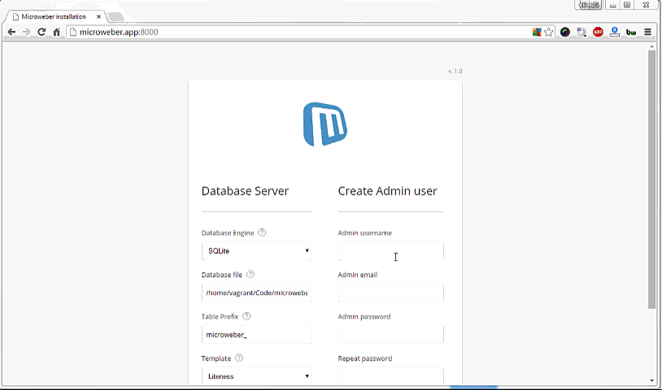

This article will show you how you can easily set-up Microweber on a vagrant box and test it on a local environment. 


This article is based on the homestead vagrant article http://www.sitepoint.com/quick-tip-get-homestead-vagrant-vm-running/ which we use as a base. 


# Step 1 
You must have Vagrant and Virtualbox installed on your system. You will also need Git and Composer in order to get the latest Microweber source code.
 
Download and install the following software:
* Vagrant - http://vagrantup.com
* Virualbox - https://www.virtualbox.org
* Git - http://git-scm.com/downloads
* Composer - https://getcomposer.org/download

# Step 2 – Getting the source code
Open the command line terminal and get the Vagrant source

If you work dir is `f:\vm\`

You must run the following command

```sh
cd f:\vm\
git clone https://github.com/microweber-dev/homestead_improved.git
```

# Step 3 – set up sites and folders

If your location is `f:\vm\`, open the `f:\vm\homestead_improved\Homestead.yaml` file and edit your settings 


Your `Homestead.yaml` file should have the following information

```yaml
sites:
folders:
    - map: .
      to: /home/vagrant/Code

sites:
    - map: microweber.app
      to: /home/vagrant/Code/microweber

variables:
    - key: APP_ENV
      value: local

```


# Step 4 – hosts

Open your hosts file and add the following line. 
```
127.0.0.1 microweber.app
```

Find more instructions for the hosts setup [here](http://www.rackspace.com/knowledge_center/article/how-do-i-modify-my-hosts-file "") 


# Step 5 – Getting the Microweber code

You can download the source code from here [https://microweber.com/download.php](https://microweber.com/download.php "")

Unzip the files in your vagrant folder `/home/vagrant/Code/microweber/`

Or you can directly get the code using composer

```
cd f:\vm\homestead_improved
composer create-project microweber/microweber microweber 1.0.x-dev  --prefer-dist 
```


# Run Vagrant

```
cd f:\vm\homestead_improved
vagrant up
```

# Install Microweber

Open your browser at http://microweber.app:8000/ and you should see the install screen.


Follow the install steps and you are all set! 





